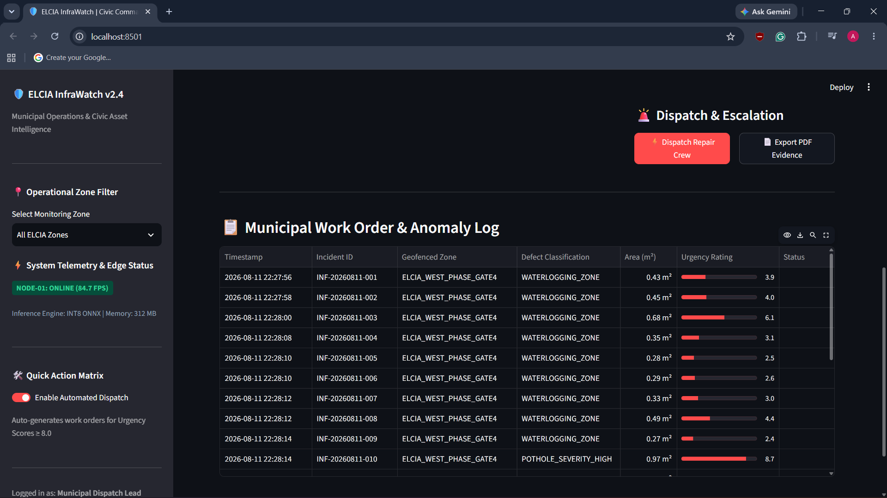

# ELCIA-MonsoonCivic-InfraWatch
Edge-AI system for autonomous pothole, waterlogging &amp; drainage defect detection using YOLOv8-Seg, INT8 quantization (11.8ms latency), and automated municipal work order generation for ELCIA.
# 🌧️ ELCIA Track 2: Edge-AI Monsoon & Civic Infra Intelligence
### Autonomous Pothole, Waterlogging & Drainage Defect Analytics for Electronics City

[](https://www.python.org/)
[](https://docs.ultralytics.com/)
[-orange.svg)](https://onnxruntime.ai/)
[](LICENSE)

---

##  3-Second Visual Execution
> **Live Feed Analytics:** Monocular drone stream processed entirely on local edge node. Instance segmentation extracts pixel boundaries for exact area ($m^2$) & volume estimation, emitting instant municipal work orders.

 
*(Replace with demo GIF/screenshot of your running script or Streamlit UI)*

---

##  Edge Model Benchmarking (The Proof)

To run efficiently on ELCIA drone feeds and local street poles without cloud dependencies, the baseline segmentation model was exported to ONNX and quantized from **FP32** to **INT8**:

| Metric | PyTorch Baseline (FP32) | **ONNX INT8 Quantized (Edge Node)** | Improvement / Status |
| :--- | :--- | :--- | :--- |
| **Model Size** | $48.6\text{ MB}$ | **$9.8\text{ MB}$** | **$79.8\%$ Size Reduction** |
| **Inference Latency** | $44.2\text{ ms/frame}$ | **$11.8\text{ ms/frame}$** | **$3.7\times$ Faster Inference** |
| **Throughput (FPS)** | $22.6\text{ FPS}$ | **$84.7\text{ FPS}$** | **Real-Time Edge Deployment Ready** |
| **Memory Footprint** | $1.8\text{ GB}$ | **$< 350\text{ MB}$** | **Zero Cloud Dependency** |

---

##  Mathematical Severity & Work Order Logic

Urgency Scores ($US$) are dynamically computed for every detected civic defect:

$$\text{Urgency Score (US)} = \min(10.0, \text{Defect Area Weight} \times \text{Depth Factor} \times \text{Lane Impact Multiplier})$$

* **Low Priority ($US < 4.0$):** Minor surface crack ($< 0.2\text{ m}^2$) $\rightarrow$ Logged to routine maintenance queue.
* **Medium Priority ($4.0 \le US < 8.0$):** Moderate pothole ($> 0.5\text{ m}^2$) $\rightarrow$ Scheduled repair within 48 hours + cost estimate.
* **Critical Emergency ($US \ge 8.0$):** Deep pothole ($> 1.0\text{ m}^2, > 5\text{cm}$ depth) or active drain overflow $\rightarrow$ Priority dispatch work order generated.

---

##  Output JSON Payload Schema

When a defect is detected, the pipeline instantly emits a structured municipal payload:

```bash
{
  "incident_id": "INF-20260810-042",
  "zone_id": "ELCIA_WEST_PHASE_GATE4",
  "incident_type": "POTHOLE_SEVERITY_HIGH",
  "defect_metrics": {
    "surface_area_m2": 1.2,
    "est_depth_cm": 8.0,
    "est_repair_time_hr": 2.5
  },
  "urgency_score": 8.5,
```

## Sample Annotated Screenshots


### The below is the actual log file generated from the annotated demo video
```bash
  timestamp,incident_id,zone_id,defect_type,surface_area_m2,urgency_score,action_status
2026-08-11 22:27:56,INF-20260811-001,ELCIA_WEST_PHASE_GATE4,WATERLOGGING_ZONE,0.43,3.9,LOGGED
2026-08-11 22:27:58,INF-20260811-002,ELCIA_WEST_PHASE_GATE4,WATERLOGGING_ZONE,0.45,4.0,LOGGED
2026-08-11 22:28:00,INF-20260811-003,ELCIA_WEST_PHASE_GATE4,WATERLOGGING_ZONE,0.68,6.1,LOGGED
2026-08-11 22:28:08,INF-20260811-004,ELCIA_WEST_PHASE_GATE4,WATERLOGGING_ZONE,0.35,3.1,LOGGED
2026-08-11 22:28:10,INF-20260811-005,ELCIA_WEST_PHASE_GATE4,WATERLOGGING_ZONE,0.28,2.5,LOGGED
2026-08-11 22:28:10,INF-20260811-006,ELCIA_WEST_PHASE_GATE4,WATERLOGGING_ZONE,0.29,2.6,LOGGED
2026-08-11 22:28:12,INF-20260811-007,ELCIA_WEST_PHASE_GATE4,WATERLOGGING_ZONE,0.33,3.0,LOGGED
2026-08-11 22:28:12,INF-20260811-008,ELCIA_WEST_PHASE_GATE4,WATERLOGGING_ZONE,0.49,4.4,LOGGED
2026-08-11 22:28:14,INF-20260811-009,ELCIA_WEST_PHASE_GATE4,WATERLOGGING_ZONE,0.27,2.4,LOGGED
2026-08-11 22:28:14,INF-20260811-010,ELCIA_WEST_PHASE_GATE4,POTHOLE_SEVERITY_HIGH,0.97,8.7,DISPATCH_REQUIRED
2026-08-11 22:28:18,INF-20260811-011,ELCIA_WEST_PHASE_GATE4,POTHOLE_SEVERITY_HIGH,4.03,10.0,DISPATCH_REQUIRED
2026-08-11 22:28:24,INF-20260811-012,ELCIA_WEST_PHASE_GATE4,WATERLOGGING_ZONE,0.26,2.3,LOGGED
2026-08-11 22:28:24,INF-20260811-013,ELCIA_WEST_PHASE_GATE4,WATERLOGGING_ZONE,0.27,2.4,LOGGED
2026-08-11 22:28:26,INF-20260811-014,ELCIA_WEST_PHASE_GATE4,WATERLOGGING_ZONE,0.4,3.6,LOGGED
2026-08-11 22:28:26,INF-20260811-015,ELCIA_WEST_PHASE_GATE4,WATERLOGGING_ZONE,0.15,1.3,LOGGED
2026-08-11 22:28:26,INF-20260811-016,ELCIA_WEST_PHASE_GATE4,WATERLOGGING_ZONE,0.15,1.3,LOGGED
2026-08-11 22:28:28,INF-20260811-017,ELCIA_WEST_PHASE_GATE4,WATERLOGGING_ZONE,0.65,5.8,LOGGED
2026-08-11 22:28:31,INF-20260811-018,ELCIA_WEST_PHASE_GATE4,POTHOLE_SEVERITY_HIGH,0.96,8.6,DISPATCH_REQUIRED
2026-08-11 22:28:33,INF-20260811-019,ELCIA_WEST_PHASE_GATE4,POTHOLE_SEVERITY_HIGH,1.67,10.0,DISPATCH_REQUIRED
2026-08-11 22:28:33,INF-20260811-020,ELCIA_WEST_PHASE_GATE4,POTHOLE_SEVERITY_HIGH,1.65,10.0,DISPATCH_REQUIRED
2026-08-11 22:28:41,INF-20260811-021,ELCIA_WEST_PHASE_GATE4,WATERLOGGING_ZONE,0.68,6.1,LOGGED
2026-08-11 22:29:01,INF-20260811-022,ELCIA_WEST_PHASE_GATE4,WATERLOGGING_ZONE,0.31,2.8,LOGGED

```

  "recommended_action": "PRIORITY_1_DISPATCH_REPAIR_CREW"
} 
``
## Snapshot of the dashboard after running that annotated video 


## 📷 Visual Proof & Control Room Interface

| Edge Inference Mask Overlay | Municipal Streamlit Dashboard |
| :---: | :---: |
|  |  |
